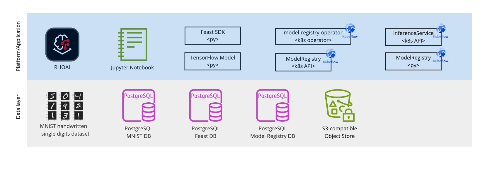

# MNIST Demo with  and Model Registry  in RHOAI 

Purpose of this demo is to replicate the [Model Registry](https://github.com/opendatahub-io/model-registry) demos that use the
[MNIST dataset](https://en.wikipedia.org/wiki/MNIST_database) to predict numbers from digital images introducing
[FEAST](https://docs.feast.dev/) as the Feature Store in a [Red Hat OpenShift AI (RHOAI)](https://www.redhat.com/en/technologies/cloud-computing/openshift/openshift-ai) environment.

Link to original demos (YouTube video and git repo):
* [Model Registry (alpha) progress demo 20240309](https://www.youtube.com/watch?v=JVxUTkAKsMU), [demo20240309-mrvanillakf](https://github.com/tarilabs/demo20240309-mrvanillakf)
* [Model Registry tech demo 20231121 e2e](https://www.youtube.com/watch?v=grXnjGtDFXg), [demo20231121](https://github.com/tarilabs/demo20231121)

## Demo Architecture

## Demo Notebooks
### Prerequisites
* PSQL DB instance created
    * Note: at least `1Gi` of memory is requested, especially if you run in ephemeral mode
* Model Registry operator installed and PSQL instance created

## Data Preparation
* [00-persist-mnist.ipynb](./00-persist-mnist.ipynb)
* [01-setup-feast.ipynb](./01-setup-feast.ipynb)

## Demo Architecture
* [02-training-and-register-mr.ipynb](./02-training-and-register-mr.ipynb)

