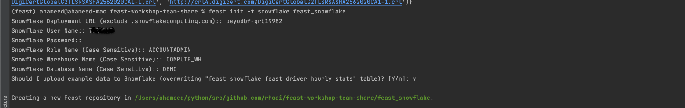
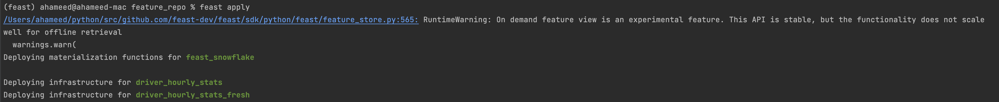
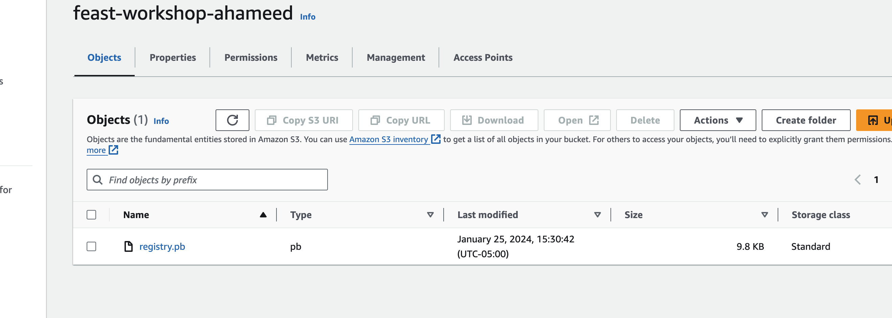
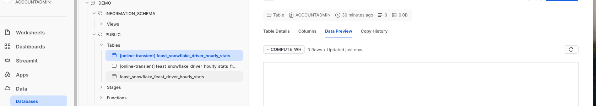
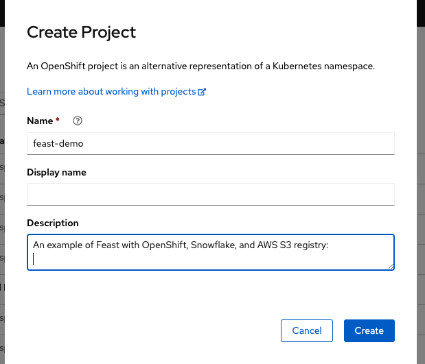
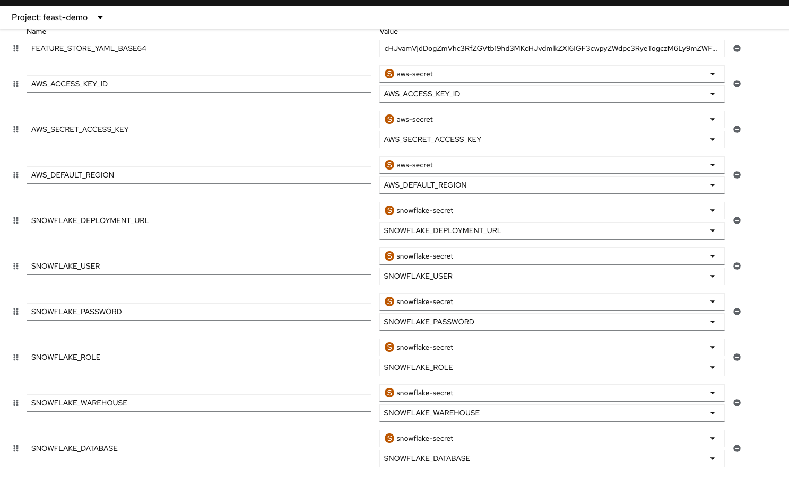
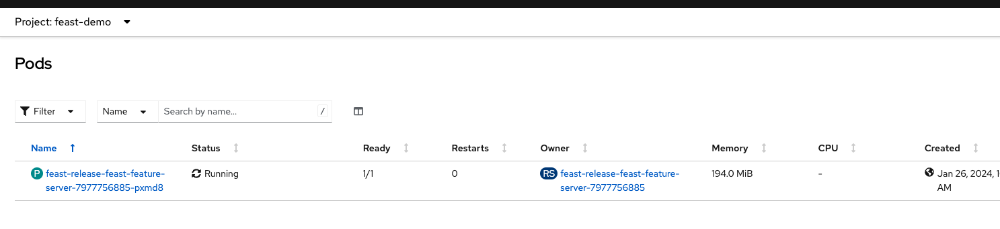
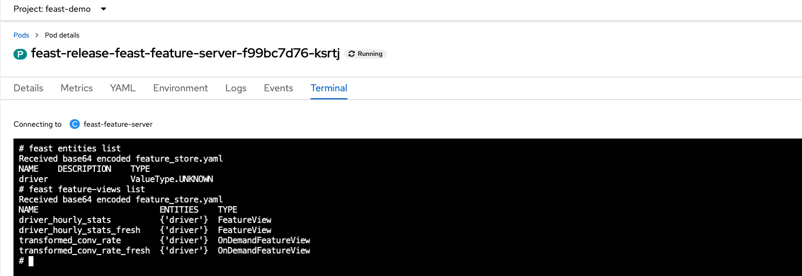
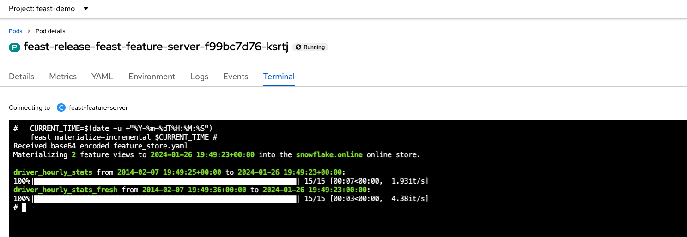

# Feast with OpenShift, Snowflake, and AWS S3 

Integrate Feast with OpenShift, Snowflake, and AWS S3 and deploy OpenShift.

## Feast Project
<details>
  <summary><strong>Setting Up a Feast Project</strong></summary>

1. **Create Project Feast Snowflake Project**:




For detailed instructions, refer to the Feast documentation: https://docs.feast.dev/how-to-guides/feast-snowflake-gcp-aws

you see the below file creation 

* `data/` contains raw demo parquet data
* `feature_repo/driver_repo.py` contains demo feature definitions
* `feature_repo/feature_store.yaml` contains a demo setup configuring where data sources are
* `test_workflow.py` showcases how to run all key Feast commands, including defining, retrieving, and pushing features.

You can run the overall workflow with `python test_workflow.py`.

2. **Configure AWS S3 as a Registry**:

Ex:
```
registry: s3://feast-workshop-ahameed/registry.pb
provider: aws
```
3. **Create Feature Store Deployment**


```
cd feature_repo 
feast apply
 ```


- **Verify that the AWS S3 bucket is updated with the Feast Registry**.



- **Check the Snowflake DEMO database for updated tables**.



</details>

## Deploy on OpenShift
<details>
  <summary><strong>Setting Up OpenShift Project</strong></summary>


#### 1. **Create a project in OpenShift**:



2. **Update  `feature_store.yaml` for Snowflake Environment:**

```
${SNOWFLAKE_DEPLOYMENT_URL}
${SNOWFLAKE_USER}
${SNOWFLAKE_PASSWORD}
${SNOWFLAKE_ROLE}
${SNOWFLAKE_WAREHOUSE}
${SNOWFLAKE_DATABASE}
```

```yaml
project: feast_snowflake
registry: s3://feast-workshop-ahameed/registry.pb
provider: aws
offline_store:
    type: snowflake.offline
    account: ${SNOWFLAKE_DEPLOYMENT_URL}
    user: ${SNOWFLAKE_USER}
    password: ${SNOWFLAKE_PASSWORD}
    role: ${SNOWFLAKE_ROLE}
    warehouse: ${SNOWFLAKE_WAREHOUSE}
    database: ${SNOWFLAKE_DATABASE}
batch_engine:
    type: snowflake.engine
    account: ${SNOWFLAKE_DEPLOYMENT_URL}
    user: ${SNOWFLAKE_USER}
    password: ${SNOWFLAKE_PASSWORD}
    role: ${SNOWFLAKE_ROLE}
    warehouse: ${SNOWFLAKE_WAREHOUSE}
    database: ${SNOWFLAKE_DATABASE}
online_store:
    type: snowflake.online
    account: ${SNOWFLAKE_DEPLOYMENT_URL}
    user: ${SNOWFLAKE_USER}
    password: ${SNOWFLAKE_PASSWORD}
    role: ${SNOWFLAKE_ROLE}
    warehouse: ${SNOWFLAKE_WAREHOUSE}
    database: ${SNOWFLAKE_WAREHOUSE}
entity_key_serialization_version: 2

```

3. **Create Secrets for Snowflake and AWS**: 

```yaml
 oc create secret generic aws-secret  --from-literal=AWS_ACCESS_KEY_ID= <>  --from-literal=AWS_SECRET_ACCESS_KEY=<> --from-literal AWS_DEFAULT_REGION=<>

 oc create secret generic snowflake-secret --from-literal=SNOWFLAKE_DEPLOYMENT_URL=<> --from-literal=SNOWFLAKE_USER=<> --from-literal=SNOWFLAKE_PASSWORD=<> --from-literal=SNOWFLAKE_ROLE=<> --from-literal=SNOWFLAKE_WAREHOUSE=<> --from-literal=SNOWFLAKE_DATABASE=<>

```

4. **Add Permissions to Security Context Constraint (SCC)**:

        oc adm policy add-scc-to-user anyuid -z default -n feast-demo 


5. **Deploy Feature Server Instances**:

   - Add the Feast Helm repository and update:

           helm repo add feast-charts https://feast-helm-charts.storage.googleapis.com
           helm repo update

   - Deploy Feast on Openshift using Helm, by setting `feature_store.yaml` file as a base64 string from feature_repo directory:

           helm install feast-release feast-charts/feast-feature-server \
           --set feature_store_yaml_base64=$(base64 < feature_store.yaml) 
'

   - Added the Enviroment variabled to deployment :




   * Verify pod is running 




  * Update the deployment if have any change.`
    ```bash 
    helm upgrade feast-release feast-charts/feast-feature-server \
        --set feature_store_yaml_base64=$(base64 < feature_store.yaml) 
    ```
 
</details>

## Testing and Verification

<details>
  <summary><strong>Testing and Verification</strong></summary>

1.**Test using Using Pod Terminal**


-Go to Pod terminal verify that able list feature viewes and entities  



- Perform a Feast materialization to push features to the online store.

    ```bash
    CURRENT_TIME=$(date -u +"%Y-%m-%dT%H:%M:%S")                                    
    feast materialize-incremental $CURRENT_TIME 
  ```



2. Test using Feature Server Route

. Create Feature Server OpenShift route

- Fetch features as per [Feature retrieval](https://docs.feast.dev/getting-started/concepts/feature-retrieval)

```bash

curl -X POST \
  "http://feast-feast-demo.apps.devshift.org/get-online-features" \
  -d '{
    "features": [
      "driver_hourly_stats:conv_rate",
      "driver_hourly_stats:acc_rate",
      "driver_hourly_stats:avg_daily_trips"
    ],
    "entities": {
      "driver_id": [1005]
    }
  }' | jq

```

```bash
curl -X POST "http://feast-feast-demo.devshift.org/push" -d '{
    "push_source_name": "driver_stats_push_source",
    "df": {
            "driver_id": [1005],
            "event_timestamp": ["2024-01-25 12:0:0"],
            "created": ["2024-01-25 13:10:21"],
            "conv_rate": [1.0],
            "acc_rate": [1.0],
            "avg_daily_trips": [1000]
    }
  }' | jq

```


</details>

